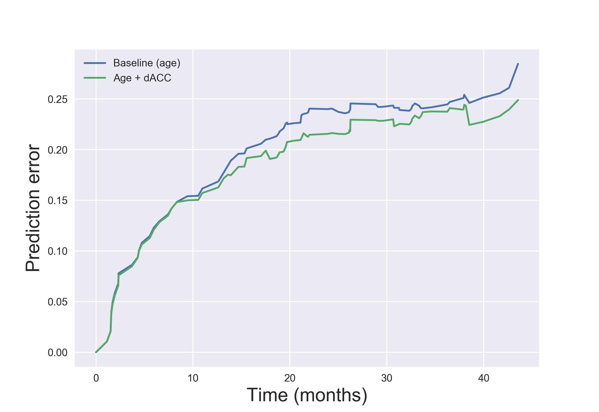

This notebook outlines the re-analysis of the criminal prediction data from Aharoni et al. (2013, PNAS).  The original code was developed by Russ Poldrack and Jeanette Mumford, and presented at http://www.russpoldrack.org/2013/04/how-well-can-we-predict-future-criminal.html.  This notebook is meant to accompany the manuscript titled "Predicting violent behavior: What can neuroscience add?" by R.Poldrack et al.

In these analyses we focus on nonviolent crimes only, excluding parole violations, as nonviolent crime was the subset that was best predicted in the followup study, and there are relatively few rearrests for violent offenses in the dataset.


```{r echo=FALSE}
library(survival)
library(rms)
library(ROCR)
library(pec)
library(colorspace)


```

First we load the data that were downloaded from the PNAS site and converted to text.
```{r}
alldata=read.table('aharoni_data_fixed.txt',header=TRUE, na.strings=".")
```

Compute the overall survival curve, and plot the Kaplan-Meier curve.

```{r}
s=survival::Surv(time=alldata$MinMonthsNonVio,event=alldata$NonVioChargeSinceScanExclPVs,type='right')
km=survfit(s~1)
plot(km,xlab='Time (months)',ylab='Survival (proportion not rearrested)')

```

```{r}

models=list("Age"=coxph(Surv(MinMonthsNonVio,   NonVioChargeSinceScanExclPVs)~releaseAge_centered, 
                       data=alldata, y=TRUE), 
            "dACC"=coxph(Surv(MinMonthsNonVio, NonVioChargeSinceScanExclPVs)~dACC_centered, 
                       data=alldata, y=TRUE), 
         	"Age.dACC"=coxph(Surv(MinMonthsNonVio, NonVioChargeSinceScanExclPVs)~releaseAge_centered+ dACC_centered, data=alldata, y=TRUE))

```


Perform cross-validation and compute prediction error.

```{r}
force_new=FALSE  # set to true to force rerunning the models

if (!file.exists('pred_err.Rdata') | force_new){
  
  nrep=500   # number of crossvalidation runs to average

  pred_err=pec(models,formula=Surv(MinMonthsNonVio, NonVioChargeSinceScanExclPVs)~1, 
                       data=alldata,
                        splitMethod="cv10", B=nrep,
                       	verbose=FALSE,
                       	keep.index=TRUE,
                       	keep.matrix=TRUE)
  save(pred_err,file='pred_err.Rdata')
} else {
  print('using saved data file')
  load('pred_err.Rdata')
}
print (pred_err)
```

Compute prediction error and compare models

```{r}

cverr=crps(pred_err,times=48.8)[,'crossvalErr']
print(sprintf('Improvement for Age+dACC over Age: %0.3f',(cverr['Age']-cverr['Age.dACC'])/cverr['Age']))
```

Save crossvalidated prediction error across all of the runs for the baseline (Age) and baseline + dACC models.  (We will plot it in python using plot_prederr.py)

```{r}

# first need to collapse the error into individual variables
nrep=length(pred_err$CrossValErrMat)
npts=length(pred_err$CrossValErrMat[[1]]$Reference)-1 # remove last point
baseline_cverr=matrix(NA,nrep,npts)
dacc_cverr=matrix(NA,nrep,npts)
for (r in 1:nrep){
  baseline_cverr[r,]=pred_err$CrossValErrMat[[r]]$Age[1:npts]
  dacc_cverr[r,]=pred_err$CrossValErrMat[[r]]$Age.dACC[1:npts]
}

write.table(baseline_cverr,file='baseline_cverr.txt')
write.table(dacc_cverr,file='dacc_cverr.txt')
```

Make figures using Python.

```{r}

system('bash runpy.sh')
library(knitr)


```

